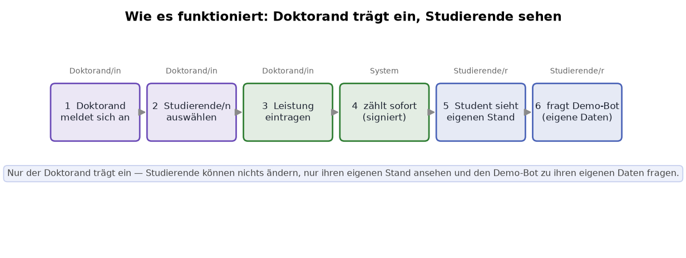
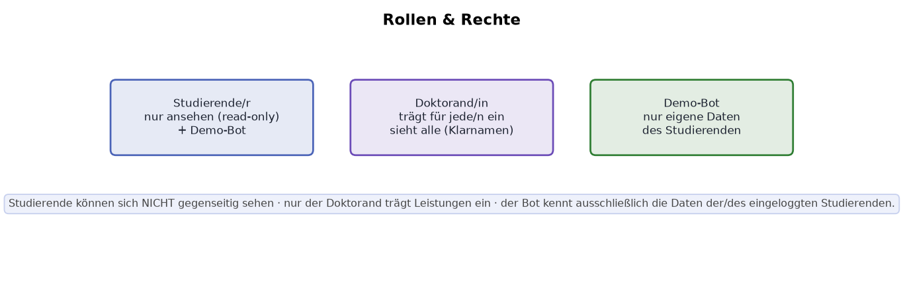
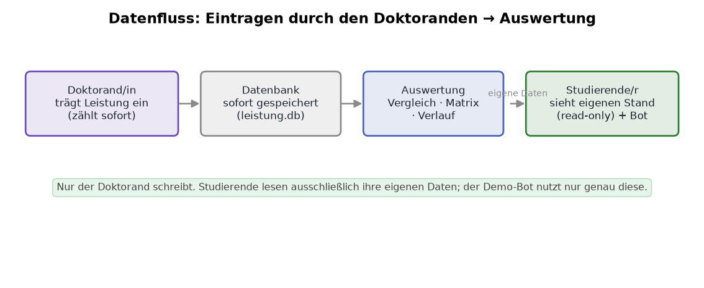
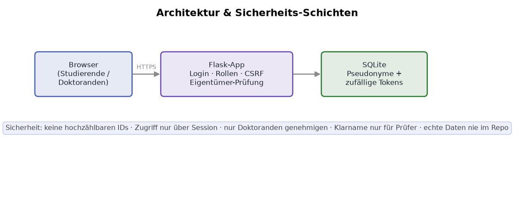
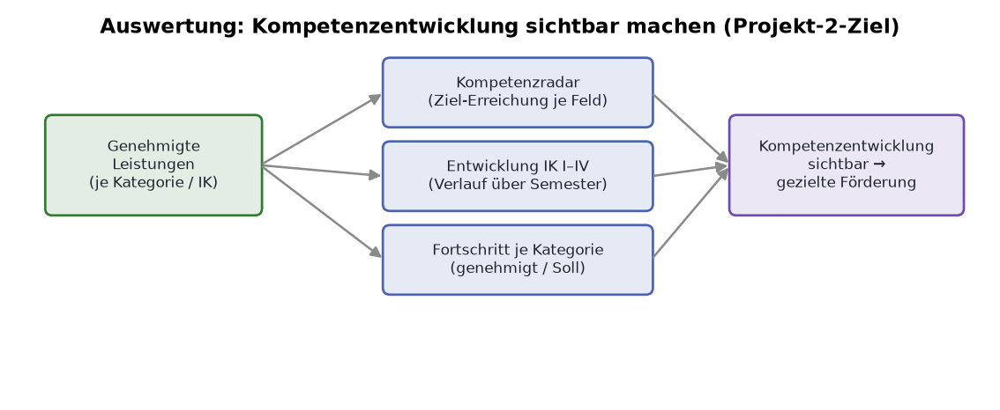

# Schaubilder & Auswertungen

Alle Grafiken werden **aus Code** erzeugt und lassen sich jederzeit aus dem
Repository neu generieren (Farben/Texte in den Skripten anpassbar).

## Erklär-Schaubilder (wie das System funktioniert)

Neu erzeugen:

```bash
python -m scripts.make_diagrams   # -> docs/diagrams/*.svg + *.png
```

| Schaubild | Datei | Inhalt |
|---|---|---|
| Schritte je Rolle | `docs/diagrams/ablauf_rollen.png` | Was Studierende (1–3) und Doktoranden (4–5) tun; Signatur & „geprüft von Dr. XYZ" (6) |
| Ablauf / Status | `docs/diagrams/workflow.png` | Entwurf → Eingereicht → Prüfung → Genehmigt / Abgelehnt |
| Datenfluss | `docs/diagrams/datenfluss.png` | Von der Eingabe (Studierende) bis zur Auswertung |
| Architektur & Sicherheit | `docs/diagrams/architektur.png` | Browser → Flask (Login/Rollen/CSRF) → SQLite |
| Auswertungs-Vision | `docs/diagrams/auswertung_vision.png` | Genehmigte Leistungen → Radar / Entwicklung / Fortschritt → Förderung |







## Auswertungs-Grafiken pro Studierendem (für Doktoranden)

Diese Grafiken zeigen die **Kompetenzentwicklung** eines Studierenden und basieren
nur auf **genehmigten** Leistungen. Sie erscheinen **live in der App** auf der
Detailseite eines Studierenden (Doktorand → „Prüfen" → „Details") und lassen sich
zusätzlich als Dateien regenerieren:

```bash
python -m scripts.student_report --all        # alle Studierenden
python -m scripts.student_report S-0R8P1w      # nur ein Pseudonym
# -> docs/reports/<pseudonym>/{radar,entwicklung,fortschritt}.{png,svg}
```

| Grafik | Aussage |
|---|---|
| **Kompetenzradar** | Ziel-Erreichung (%) je Kompetenzfeld auf einen Blick – wo ist der/die Studierende stark, wo bestehen Lücken? |
| **Entwicklung IK I–IV** | Genehmigte Punkte je Semester, gestapelt nach Kategorie – der longitudinale Verlauf über die vier klinischen Kurse. |
| **Fortschritt je Kategorie** | Genehmigte Punkte gegen die Soll-Mindestanforderung je Kategorie. |

Die Kohorten-Übersicht (alle Studierenden zusammen) liegt unter „Auswertung"
in der App. Die Grafik-Funktionen stehen zentral in `app/charts.py`.

## Warum das der Kern von Projekt 2 ist

Projekt 2 will klinische Lernverläufe **longitudinal begleiten** und Kompetenz­
entwicklung transparent machen. Sobald ein Doktorand eine Leistung genehmigt,
fließt sie automatisch in diese Grafiken – so ist jederzeit sichtbar, wie sich
ein Studierender über IK I–IV entwickelt und wo gezielt gefördert werden kann.
